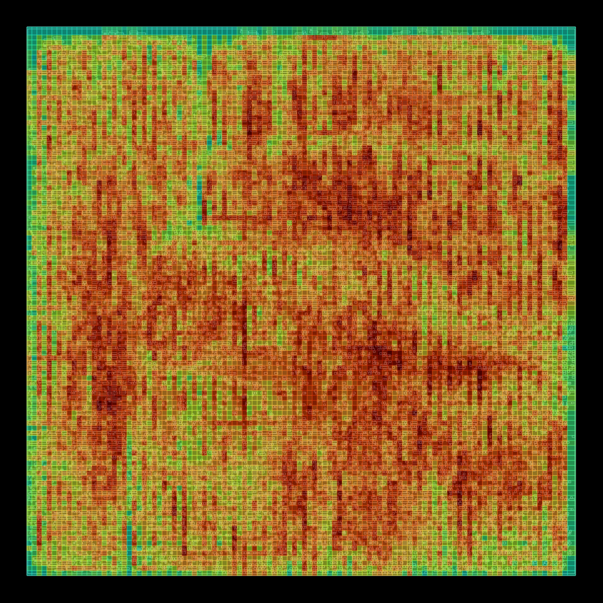
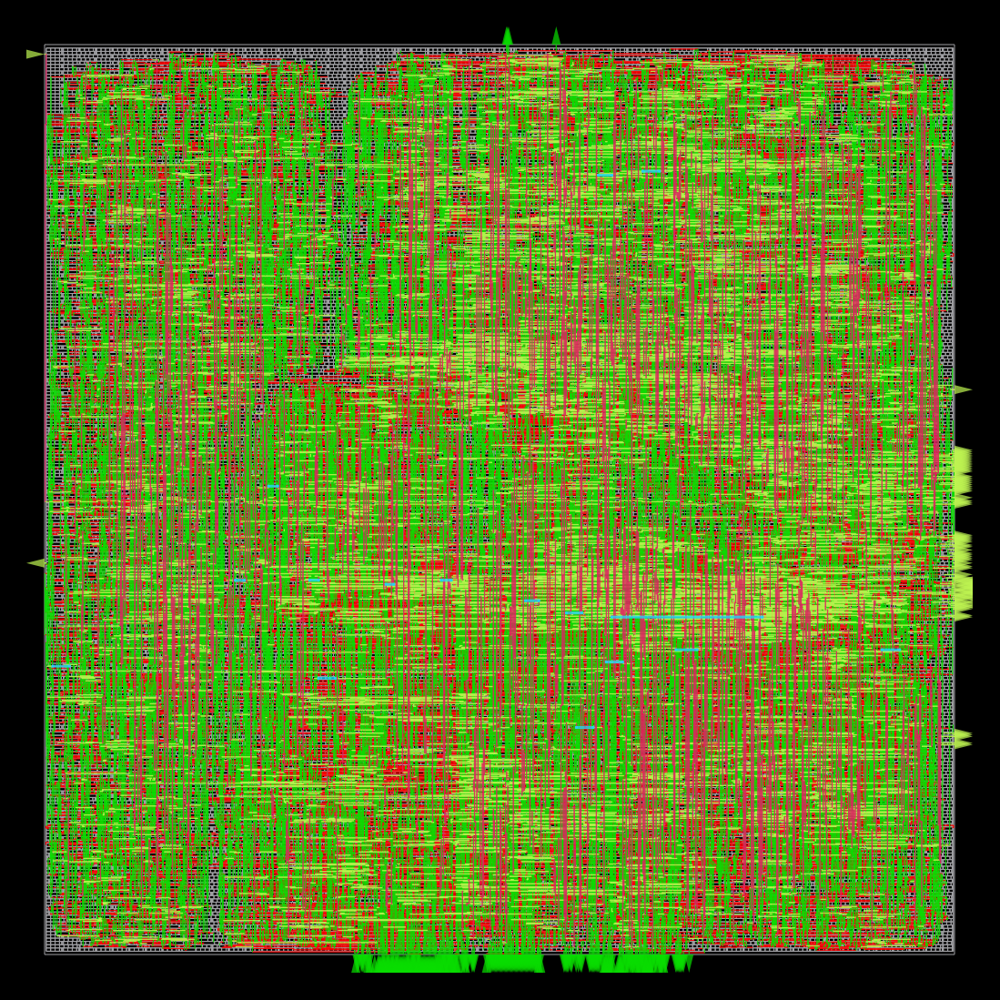
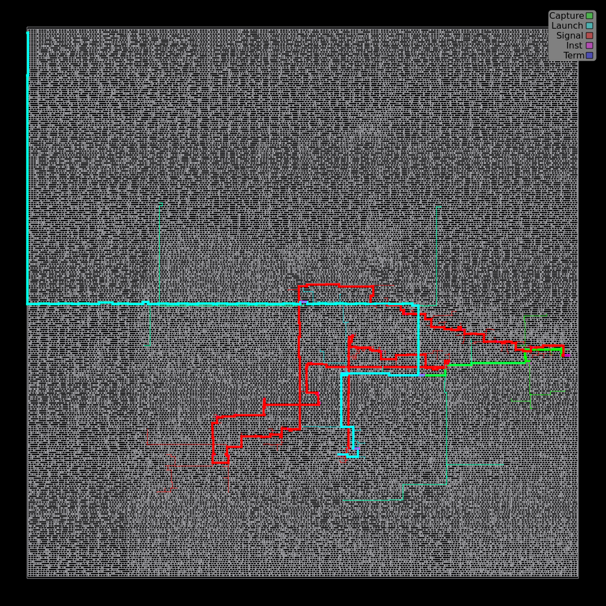

# Physical Design & Timing Analysis: RV32I v3 on Sky130
Physical implementation and timing analysis of the 2-way superscalar RV32I v3 processor using Yosys, OpenSTA, OpenROAD, and the SkyWater Sky130 open PDK.
This extends the methodology used for RV32I v2. v2 was evaluated primarily using post-synthesis OpenSTA, while v3 is taken through the complete physical-design flow: synthesis, floorplanning, placement, clock-tree synthesis, routing, and post-route timing analysis.
The main goal is to determine how the additional hardware required for superscalar execution and branch prediction affects area, timing, and achievable clock frequency.

---

## Architecture
The v3 processor is a 2-way superscalar, in-order RV32I core featuring:
- 2-wide fetch and dispatch
- Dual integer ALUs
- 4-read / 2-write register file
- Multi-lane bypass forwarding
- RAW/WAW, load-use, and structural hazard handling
- Replay of dependent instruction pairs
- Dynamic branch prediction
- Single data-memory port
An independent-ALU benchmark achieved:

```text
120 instructions / 65 cycles = 1.846 IPC
```

Representative workloads also showed improvements over the previous scalar v2 core:
| Benchmark | v2 IPC | v3 IPC | Improvement |
|---|---:|---:|---:|
| Matrix | 0.7500 | 0.8824 | +17.7% |
| Bubble Sort | 0.7600 | 1.0000 | +31.6% |

---

## Branch Predictor Evaluation

Three branch predictors were evaluated:

- **Always Not-Taken**
- **Bimodal:** 512-entry table of 2-bit saturating counters
- **Gshare:** 10-bit global history with a 1024-entry table of 2-bit saturating counters

| Benchmark | Predictor | IPC | Accuracy |
|---|---|---:|---:|
| **Fibonacci** | Not-Taken | 0.9801 | 3.45% |
| | **Bimodal** | **1.4752** | **89.66%** |
| | Gshare | 1.2314 | 55.17% |
| **Binary Search** | Not-Taken | 0.8529 | 72.20% |
| | **Bimodal** | **0.8764** | **78.03%** |
| | Gshare | 0.8512 | 71.75% |
| **Insertion Sort** | Not-Taken | 0.8711 | 89.26% |
| | **Bimodal** | **0.8862** | **93.33%** |
| | Gshare | 0.8807 | 91.48% |
| **GCD** | Not-Taken | 0.8267 | 75.16% |
| | **Bimodal** | **0.8442** | **77.74%** |
| | Gshare | 0.8380 | 76.77% |
| **String Search** | Not-Taken | 0.9408 | 82.45% |
| | Bimodal | 0.9461 | 83.97% |
| | **Gshare** | **0.9670** | **89.92%** |

Bimodal achieved both the highest prediction accuracy and the highest IPC
on four of the five representative application workloads. Gshare performed
best on String Search, where global branch history provided useful
correlation.

The advantage of Gshare became more apparent on a synthetic workload
designed to stress correlated branch behavior:

```text
Gshare:       88.75%
Bimodal:      71.46%
Not-Taken:    27.29%
```

This illustrates the intended strength of Gshare: incorporating global
branch history allows it to exploit correlations between branches that a
PC-indexed Bimodal predictor cannot capture.
For the final processor, I selected Bimodal. On the representative
application workloads evaluated here, its simpler PC-indexed predictor
provided the best accuracy and IPC in four of five cases. Although Gshare
was substantially better on the synthetic correlation test, that advantage
did not translate into better performance on most of the application
workloads evaluated for this project. Given these results and Bimodal's
simpler hardware structure, Bimodal was used for the final physical
implementation.

---

## Initial Gshare Synthesis
Without SRAM macros, the 1024 × 2-bit Gshare Pattern History Table synthesized into 2,048 flip-flops plus its associated indexing and selection logic.

```text
Total core:
    Cells:                  22,562
    Area:                 0.237605 mm²
Gshare predictor:
    Cells:                   8,996
    Area:                 ~0.108051 mm²
    PHT flip-flops:           2,048
    Share of core area:      ~45.5%
Register file:
    Cells:                   6,428
    Area:                 ~0.067926 mm²
```

The branch predictor alone occupied nearly half of the synthesized core and was larger than the 4R/2W register file.

---

## Pre-Layout OpenSTA: Gshare
Standalone OpenSTA was first used to characterize the synthesized design at the same 17 ns target used for v2.

```text
Clock period:     17.00 ns
Target frequency: 58.82 MHz
WNS:             -96.07 ns
TNS:         -386,257.78 ns
```

The worst paths were dominated by the standard-cell implementation of the Gshare PHT. Several predictor nets had fanouts exceeding 1,000 loads, producing extreme slew and delay.
This demonstrated an important limitation of implementing memory-like structures as discrete flip-flops: an RTL array that is logically simple can become a large network of registers, decoders, and multiplexers after synthesis.
OpenSTA can identify these problems but does not perform placement, buffering, cell resizing, or routing to repair them.

---

## Switching to Bimodal
Based on both application performance and implementation cost, Bimodal was selected for the final physical implementation.
The final predictor contains a 512-entry × 2-bit BHT with two combinational read ports and one update port.
Standalone synthesis produced:

```text
Total core:
    Cells:                  17,322
    Area:                 0.184122 mm²
Bimodal predictor:
    Cells:                   3,880
    Area:                 0.054059 mm²
    Predictor FFs:            1,024
Register file:
    Cells:                   6,404
    Area:                 ~0.068700 mm²
```

The Bimodal predictor still accounts for approximately 29% of the synthesized core, but substantially reduces the implementation cost relative to Gshare.

---

## Pre-Layout OpenSTA: Bimodal
At the same 17 ns clock:

```text
Clock period:     17.00 ns
Target frequency: 58.82 MHz
WNS:             -52.87 ns
TNS:         -53,668.69 ns
```

The predictor was no longer responsible for the worst paths. Instead, timing became dominated by high-fanout pipeline control signals.
A representative internal register-to-register path reported:

```text
Data arrival:    35.766 ns
Required:        16.612 ns
Slack:          -19.155 ns
```

with high-fanout nodes including:

```text
Node        Fanout      Slew        Delay
------------------------------------------
_3742_/X      329      15.069 ns    10.755 ns
_3745_/Y      229       9.524 ns    19.295 ns
```

These paths are important because they are dominated by unbuffered global control distribution rather than a fundamentally long arithmetic datapath.
This motivated taking v3 through physical implementation instead of treating standalone OpenSTA as the final timing result.

---

## Why v2 Stopped at OpenSTA
The cacheless RV32I v2 core met the same 17 ns target using standalone OpenSTA:

```text
WNS:                 +0.55 ns
TNS:                  0.00 ns
Worst-path arrival:  15.91 ns
Target frequency:    58.82 MHz
```

Its critical path was nevertheless a high-fanout `dmem_ready`/pipeline-stall path, including a node with:

```text
Load:       1.535 pF
Slew:      10.532 ns
Delay:      7.867 ns
```

Because v2 already met its timing target, physical implementation was outside the scope of that project. The report noted that placement and buffer insertion would likely improve this high-fanout path.
v3 does not meet its target in standalone OpenSTA, so that assumption needs to be tested directly through physical implementation.

---

# OpenROAD Physical Design
The final Bimodal design is implemented using OpenROAD Flow Scripts with the Sky130 HD standard-cell library.

## Setup
On Apple Silicon:

```bash
docker pull --platform linux/amd64 openroad/orfs:latest
```

Launch the flow:
```bash
docker run --rm -it \
  --platform linux/amd64 \
  -u "$(id -u):$(id -g)" \
  -e OMP_NUM_THREADS=1 \
  -e KMP_AFFINITY=disabled \
  -v "$(pwd):/riscv-v3" \
  -v "$(pwd)/3-sta/OpenROAD-flow-scripts/flow:/work" \
  -e FLOW_HOME=/OpenROAD-flow-scripts/flow \
  -e WORK_HOME=/work \
  openroad/orfs:latest \
  bash
```

The implementation uses:

```text
Clock period:       17.00 ns
Clock uncertainty:   0.25 ns
Target frequency:   58.82 MHz
Core utilization:      35%
Placement density:      40%
```

---

## 1. Synthesis
Synthesis converts the SystemVerilog design into a Sky130 standard-cell netlist.

```bash
make synth \
  DESIGN_CONFIG=./designs/sky130hd/riscv_v3/config.mk
```

Result:

```text
Design area: 199,156 µm²
```

---

## 2. Floorplanning

Floorplanning defines the die/core dimensions, standard-cell rows, and available placement area.

```bash
make floorplan \
  DESIGN_CONFIG=./designs/sky130hd/riscv_v3/config.mk
```

The design intentionally uses low utilization to leave room for buffering, cell resizing, and routing.

```text
Die size:        ~756.33 × 756.33 µm
Core area:       ~565,998 µm²
```

---

## 3. Placement
Placement assigns physical locations to the synthesized standard cells and optimizes their positions for wire length, congestion, and timing.

```bash
make place \
  DESIGN_CONFIG=./designs/sky130hd/riscv_v3/config.mk
```

Results:

```text
Instances:               25,526
Nets:                    18,484
Pins:                    71,246
Original HPWL:          891,732 µm
Optimized HPWL:         865,684 µm
Design area:            214,459 µm²
Utilization:                 38%
```

Detailed placement completed with zero overlaps, alignment problems, or edge-spacing violations.

---

## 4. Clock Tree Synthesis
CTS inserts and balances clock buffers so that the clock can physically drive the thousands of sequential elements in the design while controlling clock slew and skew.

```bash
make cts \
  DESIGN_CONFIG=./designs/sky130hd/riscv_v3/config.mk
```

CTS completed successfully.

---

## 5. Routing
Routing creates the physical metal and via connections between the placed cells.

```bash
make route \
  DESIGN_CONFIG=./designs/sky130hd/riscv_v3/config.mk
```

The routed design contains approximately:

```text
Components:    25,834
Nets:          18,478
Terminals:        303
```

Routing consists of pin-access analysis, global routing, and detailed routing while satisfying the Sky130 physical design rules.

---

## 6. Post-Route Timing Analysis

After detailed routing, OpenROAD performs timing analysis using the
physically implemented clock and signal networks with extracted
interconnect parasitics.

This provides an important comparison with the standalone post-synthesis
OpenSTA analysis. Before physical implementation, the Bimodal design
reported severe timing violations dominated by high-fanout pipeline-control
signals:

```text
Pre-layout OpenSTA @ 17 ns

WNS:    -52.87 ns
TNS: -53,668.69 ns
```

After placement, buffering, cell sizing, clock-tree synthesis, and routing,
the final physical implementation meets the original 17 ns timing target:

```
Clock constraint:       17.00 ns
Target frequency:       58.82 MHz

WNS:                      0.00 ns
TNS:                      0.00 ns
Worst setup slack:       +5.90 ns

Reported min period:     11.10 ns
Reported Fmax:           90.12 MHz
```

The result demonstrates that the severe post-synthesis timing violations
were primarily a physical implementation problem rather than an inherently
long arithmetic datapath. Physical buffering, placement, clock-tree
synthesis, and routing substantially improved the high-fanout control
distribution.
The 90.12 MHz value is OpenROAD's reported post-route minimum-period
estimate. The implementation itself was optimized and closed against a
17 ns (58.82 MHz) clock constraint; therefore, 58.82 MHz is the demonstrated
implementation target, while 90.12 MHz represents estimated timing margin
rather than a separately closed 90 MHz implementation.

---

## 7. Physical Verification

The completed design was exported to GDSII and checked using the Sky130
physical verification flow.

```text
Final design area:        226,415 µm²
Final utilization:             40%

Antenna violations:             0
KLayout DRC violations:         0
LVS:               Netlists match
```

Detailed routing initially encountered 26,216 routing violations. The
router iteratively repaired these violations, followed by antenna-diode
insertion and incremental rerouting, ultimately converging to zero
detailed-routing and antenna violations.
The final merged GDSII subsequently passed the Sky130 KLayout DRC with
zero reported violations and LVS reported:

```
Congratulations! Netlists match.
```

---

### Final Physical Layout



Final Sky130HD physical implementation of the 2-way superscalar RV32I core
after placement, CTS, detailed routing, antenna repair, and filler insertion.

### Detailed Routing



The routed core contains approximately 1.17 m of interconnect across the
available metal stack and roughly 176k vias.

### Clock Tree


Clock-tree synthesis physically distributes the clock across the sequential
state of the processor, inserting and balancing clock buffers to control
slew and skew.

### Post-Route Critical Path



---

# Conclusions
The v3 implementation demonstrates why processor structures should be evaluated using both architectural performance and physical implementation cost.

Gshare provided better prediction on workloads with useful global branch correlation, but Bimodal achieved higher IPC on four of five representative applications while requiring substantially less hardware. The standard-cell Gshare implementation consumed approximately 45.5% of total synthesized area and generated severe high-fanout timing paths.

Switching to Bimodal reduced core area from approximately 0.238 mm² to 0.184 mm² and shifted the critical timing problem away from the predictor toward global pipeline-control distribution.
Unlike v2, v3 is therefore carried through the complete OpenROAD physical-design flow. The final post-route analysis will determine whether physical buffering, placement, clock-tree synthesis, and routing can recover the severe high-fanout timing penalties observed in standalone OpenSTA.

Ultimately, superscalar performance must account for both IPC and achievable clock frequency:

```text
Instruction throughput ≈ IPC × clock frequency
```

The final physical timing result therefore determines whether the IPC gains of the 2-way architecture translate into higher overall processor throughput.