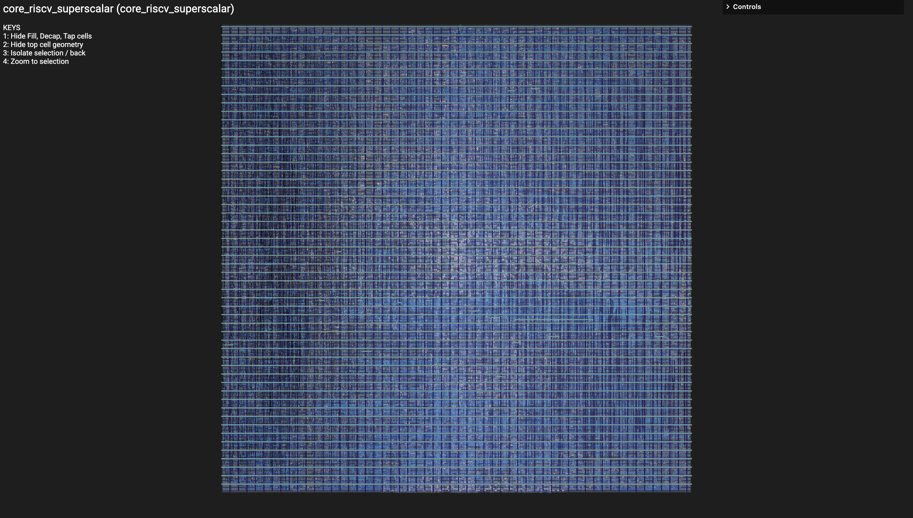
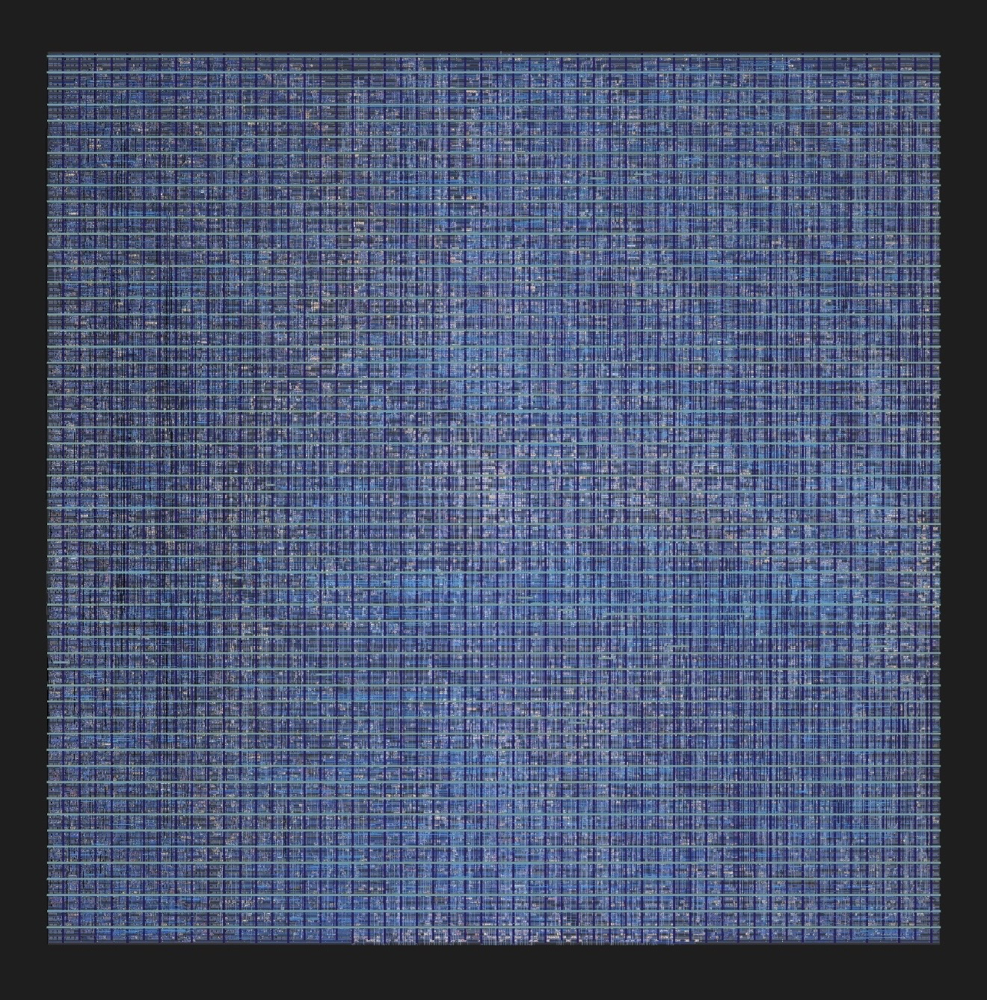

# RV32I 2-Way Superscalar Processor with Branch Prediction

<div align="center">
  
  <br>
  <sub>Final routed Sky130HD implementation of the RV32I v3 core.</sub>
</div>


A 2-way in-order superscalar RV32I processor built to explore what it actually takes to move beyond the single-issue IPC ceiling. The design adds dual-issue execution, multi-lane forwarding, hazard detection and replay, dynamic branch prediction, and two writeback paths, then carries the final Bimodal configuration through an RTL-to-GDSII physical-design flow.

---

## Motivation: Breaking the Single-Issue IPC Ceiling

My previous RISC-V v2 processor used a conventional single-issue pipeline. On several workloads, I measured approximately:

```text
Single-issue baseline (RISC-V v2):

Fibonacci:   IPC = 0.64
Matrix:      IPC = 0.75
Bubble Sort: IPC = 0.76

Theoretical maximum IPC: 1.0
```

Forwarding and hazard detection can reduce unnecessary stalls, but a single-issue processor still cannot retire more than one instruction per cycle.

RISC-V v3 explores the next step: **instruction-level parallelism**.

The core adds:

- **2-wide instruction fetch**
- **2-way in-order issue**
- **Two parallel integer execution lanes**
- **Two writeback paths**
- **Multi-lane data forwarding**
- **Dynamic branch prediction**
- **Replay/serialization for instruction pairs that cannot safely execute together**

The theoretical peak retirement rate therefore increases from **1 IPC to 2 IPC**.

A dedicated independent-ALU benchmark reaches approximately **1.85 IPC**, showing that the core can sustain close to its 2 IPC limit when enough independent work is available.

Real workloads are less ideal. Dependencies, branches, memory operations, and structural hazards reduce the amount of instruction-level parallelism that can actually be exploited. That gap between theoretical width and useful throughput is the main focus of this project.

---

## Architecture Overview

| Feature | RV32I v3 |
|---|---|
| ISA | RV32I |
| Execution | 2-way in-order superscalar |
| Fetch width | 2 instructions/cycle |
| Maximum retirement | 2 instructions/cycle |
| Execution units | 2 integer ALU lanes |
| Memory architecture | Harvard instruction/data interfaces |
| Data-memory ports | 1 |
| Branch resolution | EX stage |
| Register file | 4 read ports / 2 write paths |
| Branch prediction | Always-Not-Taken, Bimodal, Gshare |

The processor fetches two adjacent instructions and attempts to dispatch both in the same cycle. If the pair is independent and no structural hazard exists, both instructions proceed through the pipeline in parallel.

If the younger instruction cannot safely execute alongside the older instruction, the older instruction is issued first and the younger instruction is replayed. This keeps architectural state in order without giving up the ability to dual-issue independent instruction pairs.

---

# Branch Prediction

Widening the frontend makes branch prediction more important because a wrong prediction can place more speculative work behind a branch.

I implemented three prediction schemes:

```text
predictor_sel = 00    Always Not Taken
predictor_sel = 01    Bimodal
predictor_sel = 10    Gshare
```

### Always Not Taken

The static baseline predicts that every conditional branch falls through. It requires essentially no predictor-table state, but performs poorly on strongly taken loops.

### 2-Bit Bimodal

The Bimodal predictor uses a PC-indexed table of 2-bit saturating counters:

```text
00    Strongly Not Taken
01    Weakly Not Taken
10    Weakly Taken
11    Strongly Taken
```

This works well when individual branch PCs have stable behavior, especially short repetitive loops.

### Gshare

Gshare incorporates a 10-bit Global History Register and indexes a 1024-entry Pattern History Table using:

```text
index = PC[11:2] XOR GHR
```

This allows predictions to depend on recent branch history and therefore capture correlated branch behavior that a simple PC-indexed predictor cannot represent as directly.

Across the representative workloads I evaluated, Bimodal produced the best combination of branch accuracy and IPC on four of five applications. Gshare still showed the value of global correlation: it performed best on String Search and substantially outperformed Bimodal on the synthetic correlated-branch stress test.

For the final physical implementation, I selected **Bimodal**. The goal was not to argue that one predictor is universally better, but to choose the predictor that best matched the workloads evaluated here while keeping the final implementation straightforward.

---

# Performance

## Peak Superscalar Throughput

A dedicated benchmark executes a long stream of independent integer instructions to expose the maximum throughput of the 2-way pipeline.

```text
cycles              = 65
benchmark instr     = 120
IPC                 ≈ 1.85

dual issue cycles   = 64
single issue cycles = 1
stall cycles        = 0
replay cycles       = 0
flush cycles        = 0
```

The core is therefore not just structurally two-wide: with sufficient instruction-level parallelism, it can sustain execution close to its theoretical **2 IPC** limit.

## Representative Workloads

The more interesting results come from workloads where dependencies, branches, and memory traffic prevent ideal dual issue.

| Workload | v2 IPC | v3 IPC |
|---|---:|---:|
| Matrix | 0.75 | 0.8824 |
| Bubble Sort | 0.76 | 1.0000 |

Fibonacci is particularly dependency-heavy. With the forwarding network in place, a Gshare run produced:

```text
cycles       = 121
retired      = 149
IPC          = 1.2314

branches     = 29
mispredicts  = 13
accuracy     = 55.17%
```

Before the forwarding changes, the same workload required approximately:

```text
cycles = 239
IPC    = 0.6234
```

The branch behavior remained essentially unchanged, making this a useful example of how much throughput can be recovered by resolving data hazards through bypassing instead of conservatively stalling.

---

# What Got Harder When the Pipeline Became 2-Wide?

The interesting part of this project was not duplicating an ALU. Widening the machine changes the dependency and control problem around the execution units.

## Intra-Pair Hazards

Two adjacent instructions can conflict before either has had time to move through the normal forwarding network.

```asm
add x5, x1, x2
sub x6, x5, x4
```

The younger `sub` needs the result produced by the older `add`, but that result does not yet exist when the pair is dispatched. The pair therefore cannot execute simultaneously.

The same problem occurs for WAW dependencies. In these cases, the older instruction proceeds and the younger instruction is serialized and replayed.

## Register-File Bandwidth

Two instructions can require four source operands while two older instructions reach writeback in the same cycle. The register file therefore uses **four read ports and two write paths** while preserving normal RV32I behavior such as `x0` always reading as zero.

## Multi-Lane Forwarding

Each execution lane may depend on results produced by either older lane.

Possible forwarding sources include:

```text
Original register value
WB lane 1
WB lane 2
MEM lane 1
MEM lane 2
```

Forwarding is also required for branch comparisons, JALR targets, and store data. Loads need special handling because the MEM-stage ALU result is the address, not the loaded value; a true load-use dependency still requires a bubble.

## Branch Recovery

When a branch is mispredicted, younger wrong-path instructions must be prevented from modifying architectural state.

The core detects the misprediction in EX, computes the correct next PC, flushes younger instructions, redirects fetch, and updates the predictor.

---

# Verification

Verification is split between directed simulation and formal properties.

The main directed regression exercises arithmetic, hazards, forwarding, branches, memory operations, and superscalar execution:

```text
PASS: 32
FAIL: 0

cycles  = 41
retired = 37
IPC     = 0.9024
```

Separate workload testbenches are used for performance characterization rather than basic instruction correctness.

Formal verification uses SystemVerilog Assertions and SymbiYosys to check architectural invariants such as:

- `x0` always remains zero
- Invalid pipeline entries cannot commit register writes
- Invalid instructions cannot perform memory writes
- Pipeline flushes prevent wrong-path instructions from committing
- Register writes only target valid destination registers
- In-order architectural behavior is preserved
- Hazard logic prevents unresolved dependencies from executing incorrectly

High IPC is only useful if the resulting architectural state is still correct.

---

# RTL-to-GDSII Physical Implementation

The final **Bimodal** configuration was taken through a complete physical-design flow using OpenROAD and the Sky130HD standard-cell library.

```text
SystemVerilog RTL
       ↓
Synthesis
       ↓
Floorplanning
       ↓
Placement
       ↓
Clock-Tree Synthesis
       ↓
Global + Detailed Routing
       ↓
Parasitic Extraction
       ↓
Post-Route STA
       ↓
DRC / LVS
       ↓
GDSII
```

The original implementation target was **17 ns (58.82 MHz)**. The completed post-route design closed that target with no setup or hold violations. On the second run, the implementation target became **11 ns (90.0 MHz)**, which also completed post-route design with no setup or hold times.

| Metric | Final 17 ns Implementation |
|---|---:|
| Final design area | 0.2264 mm² |
| Target clock period | 17.0 ns |
| Setup violations | 0 |
| Hold violations | 0 |
| Reported minimum period | 11.10 ns |
| Reported Fmax estimate | 90.12 MHz |
| Antenna violations | 0 |
| KLayout DRC violations | 0 |
| LVS | Match |

| Metric | Final 11 ns Implementation |
|---|---:|
| Final design area | 0.2266 mm² |
| Target clock period | 11.0 ns |
| Setup violations | 0 |
| Hold violations | 0 |
| Timing-closed frequency | 90.91 MHz |
| Worst setup slack | +0.95 ns |
| Reported minimum period | 10.05 ns |
| Reported Fmax estimate | 99.45 MHz |
| KLayout DRC violations | 0 |
| LVS | Match |

The detailed synthesis, STA, placement, CTS, routing, extraction, and signoff results live under [`3-sta/`](./3-sta/).

---

# Physical Microarchitecture

<div align="center">
  
</div>

The final design is standard-cell based rather than manually partitioned into hard architectural macros. To make the physical result easier to interpret, I mapped cells from major RTL hierarchies back onto the final layout and visualized the regions where those structures are concentrated. First I changed the coloring of the grid:

<div align="center">
  
  <br>
  <sub>Stylized visualization derived from the final routed physical implementation.</sub>
</div>

Then, I was able to derive this diagram using the `.odb`, `.def`, and the synthesized `.v` file to loosely identify each component in the final die.

<div align="center">
  
  <br>
  <sub>
    Major RTL structures projected onto the final physical implementation.
    Rectangles show dominant physical neighborhoods, not hard-macro boundaries.
  </sub>
</div>

---

# Repository Structure

```text
/0-rtl/    - SystemVerilog implementation of the processor
/1-sim/    - directed tests, workloads, and IPC/predictor benchmarks
/2-formal/ - SystemVerilog assertions and SymbiYosys scripts
/3-sta/    - synthesis, STA, OpenROAD physical implementation, and signoff results
```

---

# Build & Simulate

## Compile

I use Icarus Verilog for RTL simulation.

```bash
iverilog -g2012 -I ../0-rtl \
    -o fib_sim \
    tb_fib.sv \
    ../0-rtl/core_riscv_superscalar.sv \
    ../0-rtl/*.sv
```

A file list can also be used:

```bash
iverilog -g2012 -o fib_sim -c files.txt
```

## Run

Select the predictor using a plusarg:

```bash
vvp fib_sim +pred=0    # Always Not Taken
vvp fib_sim +pred=1    # Bimodal
vvp fib_sim +pred=2    # Gshare
```

Other workload executables can be run in the same way:

```bash
vvp bubblesort_sim +pred=2
vvp matrix_sim +pred=2
vvp ipc_sim
```

A typical benchmark reports cycles, retired instructions, IPC, branch count, mispredictions, and predictor accuracy.

---

# Takeaway

The goal of RISC-V v3 was not simply to add another execution lane. It was to understand what happens to the rest of a processor when the machine becomes wider.

Moving from single-issue to 2-way execution raised the theoretical retirement rate from **1 IPC to 2 IPC**, but actually approaching that limit required solving the dependency, forwarding, replay, register-file, and branch-recovery problems created by issuing multiple instructions together.

The independent benchmark reaches approximately **1.85 IPC**, while the workload results show why real execution moves away from that ideal. The final Bimodal configuration was then carried through physical implementation to a routed, timing-clean, DRC-clean, LVS-matching Sky130 GDSII design.

In other words: the interesting part was not just making the processor wider. It was finding out what widening the processor breaks, fixing it, measuring whether it helped, and then seeing whether the resulting design could still be physically implemented.
